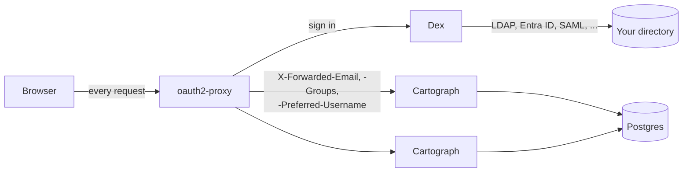

# cartograph-oidc

Cartograph behind your organisation's single sign-on, with access by
role and team taken from your directory.

People sign in with their organisation account. Their directory groups
decide what they hold in Cartograph: which of four roles, and which
teams' work they may change. An administrator sees and adjusts it all
on Cartograph's Access page. Everyone sees who else is on a screen by
the name the directory gives them.

This repository adds no code to Cartograph. It puts released pieces
together: Dex, oauth2-proxy and Cartograph's own access control
(cartograph-engine ADR 0011). That is the point of it: it is the
reference for integrating Cartograph without a fork.

## How it fits together



1. A person opens Cartograph. oauth2-proxy has no session for them, so
   it sends them to Dex.
2. Dex signs them in against the directory through a connector, and
   issues an ID token carrying their email, display name and groups.
3. oauth2-proxy keeps the session in a cookie and passes every request
   on to Cartograph with headers saying who it is.
4. Cartograph reads those headers (`CARTOGRAPH_AUTH=proxy`) and looks
   the person up on its access list (`CARTOGRAPH_AUTHZ=access`). A
   person whose groups grant a role is listed at their first sign-in.
5. Every write is checked against their roles and against the teams the
   work belongs to, including live edits on the sync socket.

Dex is the one piece that knows your directory. Swapping LDAP for
Microsoft Entra ID, or for SAML, changes one connector in Dex's
configuration and nothing else.

## Try it

You need Docker and Nix (`just` runs in Nix's shell).

```
just up
```

Open <http://localhost:4180> and sign in as anyone below. Every password
is `try-cartograph`.

| Person | Groups | What Cartograph gives them |
|---|---|---|
| ada@example.org | staff, cartograph-administrators | Reader and administrator: everything, and the Access page |
| lee@example.org | staff, curriculum-division | Contributor for the curriculum division, and early grades beneath it |
| mia@example.org | staff, early-grades-team | Contributor for early grades only |
| sam@example.org | staff, assessment-unit | Contributor for assessment |
| ren@example.org | staff, planning-unit | Strategy editor: goals, vision and mission |
| noor@example.org | staff | Reader: sees everything, changes nothing |
| vic@example.org | visitors | Nothing: told they are not on the access list |

The people, groups and projects are fictional, from Cartograph's running
example of a ministry of education (`config/glauth.cfg`, `seed/`).

Sign in as Lee and open *Add a grade 2 reading check*: it belongs to the
assessment team, so every control is disabled and a line says why. Open
*Coach early-grade teachers in reading*, which the early grades team
runs: Lee may change it, because early grades sits under Lee's
curriculum division. Sign in as Ada in another browser and open the
Access page, or open the same project and watch Lee's pointer and name.

```
just e2e     # signs each person in through Dex and checks all of the above
just down    # stops everything and drops the database
```

## The four roles

| Role | May |
|---|---|
| Reader | See every goal, definition and register, and download charters |
| Contributor | Change the projects, programmes, operations and data sources of their teams and the teams beneath them; keep the shared registers, gaps and indicators; record readings; hand off a defined project |
| Strategy editor | Shape the goals, objectives and outcomes, and the vision and mission |
| Administrator | Everything, for every team; recover removed records; change settings; decide who may sign in and what they hold |

Roles combine. What the directory gives and what an administrator
grants are kept apart: a sign-in refreshes the directory's part and
never undoes an administrator's.

## The mapping

`config/access.yaml` says which groups grant which role, and which
groups are teams:

```yaml
roles:
  reader: [staff]
  contributor: [curriculum-division, early-grades-team, assessment-unit]
  strategyEditor: [planning-unit]
  administrator: [cartograph-administrators]
teams:
  - group: curriculum-division
    name: Curriculum division
  - group: early-grades-team
    name: Early grades
    parent: Curriculum division
```

A one-off `cartograph access apply` (the `teams` service in
`compose.yaml`, a Helm hook in the chart) creates the teams before
Cartograph starts. Teams appear in Cartograph's Teams sheet, and
projects, programmes, operations and data sources name the team they
belong to.

## In production

`docs/PRODUCTION.md` walks through a Kubernetes install with the chart
in `chart/`: Microsoft Entra ID through Dex, oauth2-proxy and Cartograph
behind one ingress, Postgres, the Secrets to create, and what to check
before people sign in. `examples/entra-id` is the Entra ID connector on
its own, for a compose install.

## Versions

| Piece | Version |
|---|---|
| Cartograph | 2.3.0 |
| Dex | 2.45.1 (chart 0.25.2) |
| oauth2-proxy | 7.15.5 (chart 10.7.1) |
| GLAuth, the local directory | 2.5.4 |

## License

Apache License 2.0.
